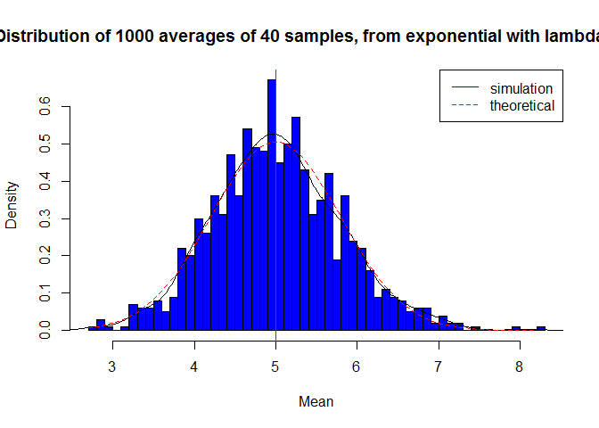
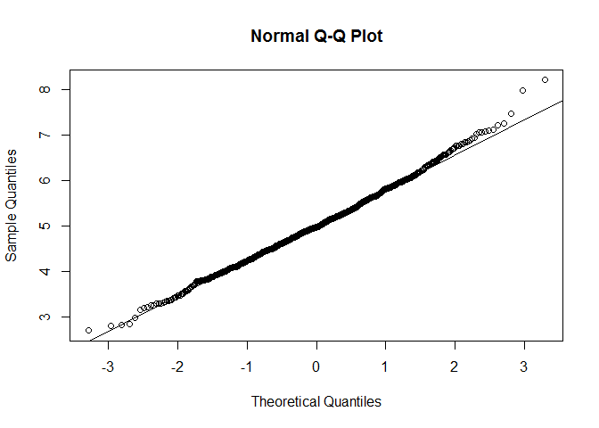
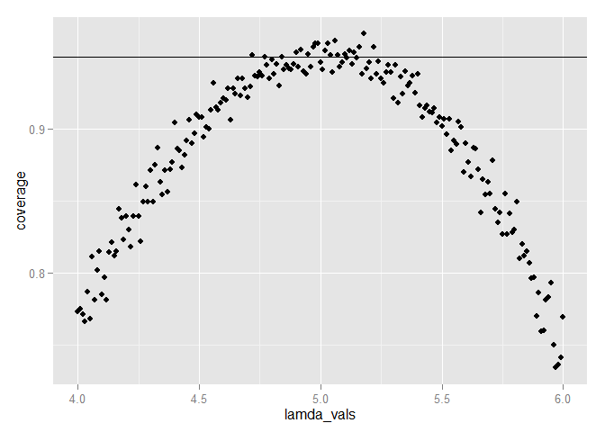

# Statistical Research - Coursera
Maruthi  
Sunday, September 21, 2014  
##Problem Statement
The exponential distribution can be simulated in R with rexp(n, lambda) where lambda is the rate parameter. The mean of exponential distribution is 1/lambda and the standard deviation is also also 1/lambda. Set lambda = 0.2 for all of the simulations. In this simulation, you will investigate the distribution of averages of 40 exponential(0.2)s. Note that you will need to do a thousand or so simulated averages of 40 exponentials.

Illustrate via simulation and associated explanatory text the properties of the distribution of the mean of 40 exponential(0.2)s.  You should
1. Show where the distribution is centered at and compare it to the theoretical center of the distribution.  
2. Show how variable it is and compare it to the theoretical variance of the distribution.  
3. Show that the distribution is approximately normal.  
4. Evaluate the coverage of the confidence interval for 1/lambda: X¯±1.96Sn???.  

##Data Analysis

A 1000 simulations of averages from 40 exponentials


```r
set.seed <- 21
lamda <- 0.2
no.sim <- 1000
no.samp<-40
simu<-matrix(rexp(no.sim*no.samp, rate = lamda),no.sim,no.samp)
row.means <- rowMeans(simu)
```

The distribution below should be similar to normal.

```r
hist(row.means, breaks=50, prob=TRUE,main="Distribution of 1000 averages of 40 samples, from exponential with lambda=0.2",xlab="Mean",col="blue")

# density plot
lines(density(row.means))

# theoretical mean
abline(v=1/lamda, col="red")

# theoretical density plot
x <- seq(min(row.means), max(row.means), length=100)
y <- dnorm(x, mean=1/lamda, sd=(1/lamda/sqrt(no.samp)))
lines(x, y, pch=20, col="red", lty=2)
# add legend
legend('topright', c("simulation", "theoretical"), lty=c(1,2), 
       col=c("blue", "red"))
```

 
The simulated mean = 5.0186
The theoritical mean = 5
The simulated variance = 0.6214
The theoritical variance = 0.625

The QQ plot below should also suggest distribution is normal.

```r
qqnorm(row.means); qqline(row.means)
```

 

Confidence Intervals


```r
lamda_vals <- seq(4, 6, by=0.01)
coverage <- sapply(lamda_vals, function(lamb) {
    mu_hats <- rowMeans(matrix(rexp(no.samp*no.sim, rate=0.2),
                               no.sim, no.samp))
    ll <- mu_hats - qnorm(0.975) * sqrt(1/lamda**2/no.samp)
    ul <- mu_hats + qnorm(0.975) * sqrt(1/lamda**2/no.samp)
    mean(ll < lamb & ul > lamb)
})

library(ggplot2)
qplot(lamda_vals, coverage) + geom_hline(yintercept=0.95)
```

 

We can see that around 5, the coverage is around 95%. This implies that sample mean falls within the confidence interval at least 95% of the time.
