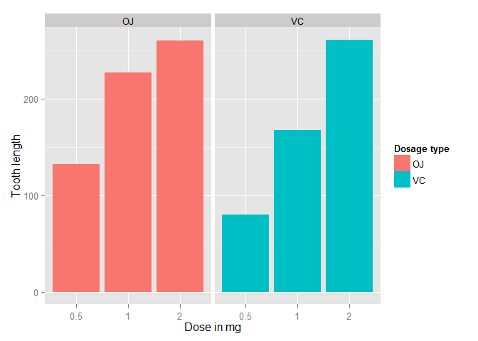

# Statistical Research - Coursera
Maruthi  
Sunday, September 21, 2014  
##Problem Statement
Now in the second portion of the class, we're going to analyze the ToothGrowth data in the R datasets package. 
Load the ToothGrowth data and perform some basic exploratory data analyses.  
Provide a basic summary of the data.  
Use confidence intervals and hypothesis tests to compare tooth growth by supp 
and dose. (Use the techniques from class even if there's other approaches worth considering)  
State your conclusions and the assumptions needed for your conclusions.   

#Data Analysis


```r
library(datasets)
summary(ToothGrowth)
```

```
##       len       supp         dose     
##  Min.   : 4.2   OJ:30   Min.   :0.50  
##  1st Qu.:13.1   VC:30   1st Qu.:0.50  
##  Median :19.2           Median :1.00  
##  Mean   :18.8           Mean   :1.17  
##  3rd Qu.:25.3           3rd Qu.:2.00  
##  Max.   :33.9           Max.   :2.00
```

```r
library(ggplot2)
ggplot(data=ToothGrowth, aes(x=as.factor(dose), y=len, fill=supp)) +
    geom_bar(stat="identity",) +
    facet_grid(. ~ supp) +
    xlab("Dose in mg") +
    ylab("Tooth length") +
    guides(fill=guide_legend(title="Dosage type"))
```

 

It should be clear that for both the dosages, the tooth length increases with the dosage.

Now, lets run a regression analysis to find the relation between dosage and tooth length


```r
fit <- lm(len ~ dose + supp, data=ToothGrowth)
summary(fit)
```

```
## 
## Call:
## lm(formula = len ~ dose + supp, data = ToothGrowth)
## 
## Residuals:
##    Min     1Q Median     3Q    Max 
## -6.600 -3.700  0.373  2.116  8.800 
## 
## Coefficients:
##             Estimate Std. Error t value Pr(>|t|)    
## (Intercept)    9.273      1.282    7.23  1.3e-09 ***
## dose           9.764      0.877   11.14  6.3e-16 ***
## suppVC        -3.700      1.094   -3.38   0.0013 ** 
## ---
## Signif. codes:  0 '***' 0.001 '**' 0.01 '*' 0.05 '.' 0.1 ' ' 1
## 
## Residual standard error: 4.24 on 57 degrees of freedom
## Multiple R-squared:  0.704,	Adjusted R-squared:  0.693 
## F-statistic: 67.7 on 2 and 57 DF,  p-value: 8.72e-16
```

The sumamry shows that 70% (R Squared) of the variance in the data could be explainied by the above equation. The intercept is 9.2725, which implies that with no supplements of Vitamin C, the average tooth length is 9.2725 units. The coefficient of dose is 9.7636. It implies that increasing the delievered dose by 1 mg, would 
increase the tooth length by 9.7636 units. The last coefficient
is for the dosage type.  The value for suppVC  is -3.7 meaning that delivering a given dose as ascorbic acid, without changing the dose, would result in 3.7 units of decrease in the tooth length. Since there are only two categories, we can also conclude that on average, delivering the dosage as OJ would increase the tooth length by 3.7 units.

95% confidence intervals for two variables and the intercept are as follows.

```r
confint(fit)
```

```
##              2.5 % 97.5 %
## (Intercept)  6.705  11.84
## dose         8.008  11.52
## suppVC      -5.890  -1.51
```
The confidence intervals mean that if we collect a different set of data and estimate parameters of the linear model many times, 95% of the time, the coefficient estimations will be in these ranges.
